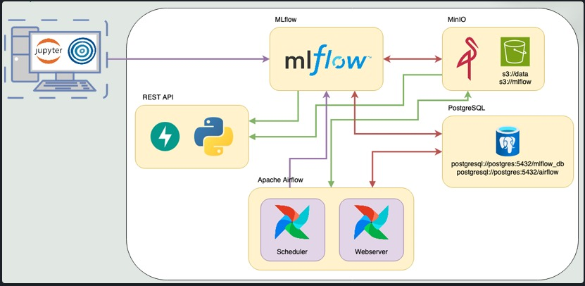

# Proyecto Final - MLOps Pipeline: Predicción de Accidentes Cerebrovasculares

Este proyecto es el trabajo final de la materia, donde implementamos un pipeline completo de Machine Learning, integrando prácticas de MLOps para el despliegue de un modelo de predicción de riesgo de enfermedades cerebrovasculares (stroke). Utilizaremos herramientas de orquestación, trazabilidad y despliegue de modelos para llevar a producción un flujo de trabajo completo de Machine Learning.

La base de datos utilizada corresponde al dataset de predicción de stroke que contiene información clínica y demográfica de pacientes para predecir la probabilidad de que sufran un accidente cerebrovascular.

## 🧩 Descripción

Simulamos trabajar para **ML Models and Something More Inc.**, una empresa que ofrece modelos como servicio mediante una API REST.  
En este proyecto integramos herramientas clave de MLOps como:
- **Apache Airflow** para la orquestación de procesos.
- **MLflow** para el tracking de experimentos y versionado de modelos.
- **Docker** para contenerización y despliegue del entorno productivo.
- **MinIO (S3-compatible)** como data lake para almacenamiento de datasets y artefactos del modelo.
- **FastAPI** para exponer el modelo entrenado mediante una API REST.

## 🎯 Objetivo

El objetivo es disponibilizar nuestro modelo de predicción de accidentes cerebrovasculares en un entorno productivo utilizando prácticas de MLOps, incluyendo:

- Preprocesamiento de datos
- Entrenamiento y evaluación del modelo
- Versionado de experimentos y artefactos
- Despliegue de una API REST para la inferencia en tiempo real
- Orquestación de todo el flujo con Airflow

## Diagrama del Proyecto

A continuación se presenta el flujo completo del pipeline de MLOps implementado en este proyecto:

## ⚙️ Herramientas

| Herramienta          | Uso en el proyecto                                      |
|---------------------|----------------------------------------------------------|
| Python              | Desarrollo del modelo de ML                              |
| Scikit-Learn        | Entrenamiento y evaluación del modelo                     |
| FastAPI             | API REST para servir el modelo                           |
| Docker              | Contenerización de servicios                             |
| MLflow              | Tracking de experimentos y modelos                       |
| Apache Airflow      | Orquestación del pipeline                                |
| MinIO               | Almacenamiento de datasets y modelos                     |
| PostgreSQL          | Base de datos para Airflow y MLflow                      |

📈 Resultados esperados

    Seguimiento de experimentos en MLflow.

    Artefactos de modelos versionados en MinIO.

    API REST desplegada y funcional para predicciones.

    Orquestación automática de pipeline de datos y entrenamiento con Airflow.

🤝 Integrantes del equipo

    - Luis Santamaría
    - Ezequiel Caamaño