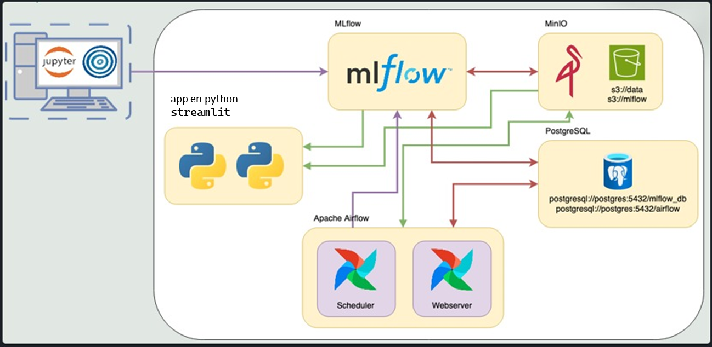
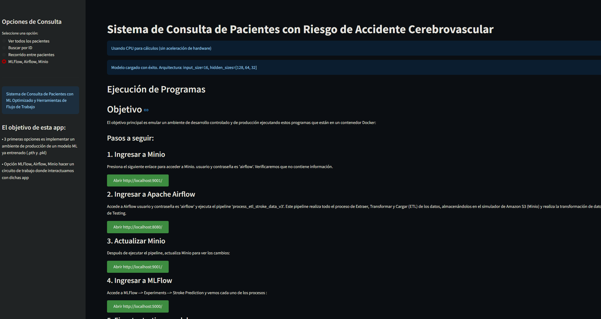

# Proyecto Final - MLOps Pipeline: Predicción de Accidentes Cerebrovasculares


[GitHub - ezecaa/stroke-mlops-final: Proyecto Final Materia Operaciones de Aprendizaje Profundo](https://github.com/ezecaa/stroke-mlops-final)


Este proyecto es el trabajo final de la materia, donde implementamos un pipeline completo de Machine Learning, integrando prácticas de MLOps para el despliegue de un modelo de predicción de riesgo de enfermedades cerebrovasculares (stroke). Utilizaremos herramientas de orquestación, trazabilidad y despliegue de modelos para llevar a producción un flujo de trabajo completo de Machine Learning.

La base de datos utilizada corresponde al dataset de predicción de stroke que contiene información clínica y demográfica de pacientes para predecir la probabilidad de que sufran un accidente cerebrovascular.

## 🧩 Descripción

--- 

Simulamos trabajar para **ML Models and Something More Inc.**, una empresa que ofrece modelos como servicio mediante una API REST.  
En este proyecto integramos herramientas clave de MLOps como:

- **Apache Airflow** para la orquestación de procesos.
- **MLflow** para el tracking de experimentos y versionado de modelos.
- **Docker** para contenerización y despliegue del entorno productivo.
- **MinIO (S3-compatible)** como data lake para almacenamiento de datasets y artefactos del modelo.

## 🎯 Objetivo

--- 

El objetivo es disponibilizar nuestro modelo de predicción de accidentes cerebrovasculares en un entorno productivo utilizando prácticas de MLOps, incluyendo:

- Implementación de persistencia del modelo e integración con app sensilla enpy  
- Preprocesamiento de datos
- Entrenamiento y evaluación del modelo
- Versionado de experimentos y artefactos


📈 Resultados esperados -  integración en sistemas docker 
--- 

- [x] Base de datos [PostgreSQL](https://www.postgresql.org/) integración  localhost y entre contenedores
- [x] **APP en streamlit** ejecutar en el terminal  ` streamlit run app_stroke.py  ` - -->  [http://127.0.0.1:8501](http://127.0.0.1:8501) 
- [x]  **[Minio](https://min.io/)**: [http://localhost:9000](http://localhost:9001/) 
- [x] [**Apache Airflow**](<[Apache Airflow](https://airflow.apache.org/)>): [http://localhost:8080](http://localhost:8080/)  
- [x] [**MLFlow**](<[MLflow](https://mlflow.org/)>): [http://localhost:5000](http://localhost:5000/)  


# 📖 Pasos para la ejecución del proyecto 
--- 

1. Descargar los archivos del repositorio 
2. Desde el terminal del sistema operativo ingresar por medio del comando `cd` a la carpeta donde se encuentra el los archivos descargados 
3. Ejecutar el comando `docker compose --profile all up -d` ejecuta los contenedores en segundo plano o `docker compose --profile all up` para descargar todas las imágenes y ejecutar los contenedores docker configurados previamente para este proyecto 
4. Una vez culminado el proceso docker ingresar a al carpeta app y ejecutar `streamlit run app_stroke.py` con este comando se ejecuta la aplicación el cual tiene tidos los sistemas integrados para la interfaz del usuario final.  **Nota el funcionamiento de la  de la app es local** no se coloco en un docker porque demoraba demasiado en la descarga y ejecución. 
5. comandos clave para la finalización del entorno docker ejecutarlos todos **Nota: elimina todos las imagens y contenedores del PC**
```
docker-compose down -v
docker rm -f (docker ps -aq)
docker rmi -f (docker images -aq)
docker volume rm (docker volume ls -q)
```


#  🤖 Vista rápida del flujo de trabajo del proyecto
---

## Contenedores 
 Tenemos la integración y la descarga de las seguintes app en un ambien docker **Apache Airflow**, 
- **MLflow** , **MinIO (S3-compatible)**, **PostgreSQL** comando para visualización en el terminal `docker ps` 


## Diagrama de integración 



## Orden de ejecución de la app



#### Bloque 1 
Integración de un modelo ML con persistencia(empaquetado) entrenado en stroke_model.pth , Preprocesamiento de datos en stroke_preprocessor.pkl con la app en python 

- Ver todos los pacientes
- Buscar por ID
- Recorrido entre pacientes
#### Bloque 2
Ejecución y visualización de los resultados correspondiente a las app MLFlow, Airflow, Minio
